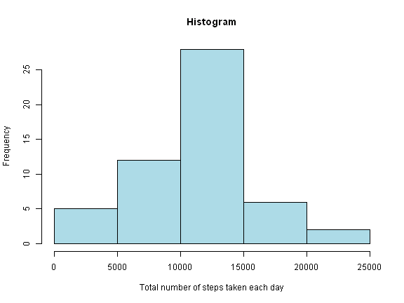
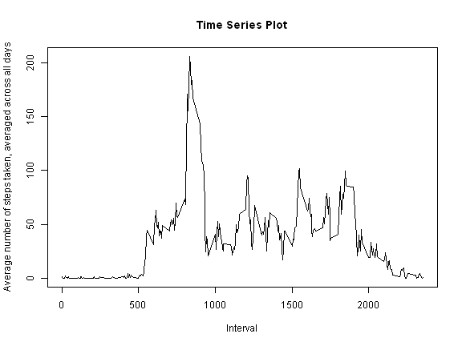

```r
library(knitr)
opts_chunk$set(fig.width=8,fig.height=6,echo=TRUE,cache=TRUE,cache.path="cache/",fig.path="Figs/")
```

## Loading and preprocessing the data
1. Load the data
2. Process/transform the data (if necessary) into a format suitable for your analysis


```r
activity<-read.csv("activity.csv", header = TRUE)
head(activity)
```

```
##   steps       date interval
## 1    NA 2012-10-01        0
## 2    NA 2012-10-01        5
## 3    NA 2012-10-01       10
## 4    NA 2012-10-01       15
## 5    NA 2012-10-01       20
## 6    NA 2012-10-01       25
```

## What is mean total number of steps taken per day?
1. Calculate the total number of steps taken per day


```r
totalSteps<-aggregate(steps ~ date, data=activity, sum, na.rm=TRUE)
head(totalSteps)
```

```
##         date steps
## 1 2012-10-02   126
## 2 2012-10-03 11352
## 3 2012-10-04 12116
## 4 2012-10-05 13294
## 5 2012-10-06 15420
## 6 2012-10-07 11015
```

2. Make a histogram of the total number of steps taken each day


```r
hist(totalSteps$steps, main="Histogram", xlab="Total number of steps taken each day", col = "lightblue")
```

 

3. Calculate and report the mean and median of the total number of steps taken per day


```r
meanSteps<-mean(totalSteps$steps)
```


```r
medianSteps<-median(totalSteps$steps)
```

-The mean total number of steps taken per day is 1.0766189 &times; 10<sup>4</sup>.

-The median total number of steps taken per day is 10765.

## What is the average daily activity pattern?
1. Make a time series plot (i.e., type = "l") of the 5-minute interval (x-axis) and the average number of steps taken, averaged across all days (y-axis)


```r
intervalData<-aggregate(steps ~ interval, data=activity, mean, na.rm=TRUE)
```


```r
plot(steps ~ interval, data=intervalData, type="l",main="Time Series Plot", xlab="Interval",ylab="Average number of steps taken, averaged across all days")
```

 

2. Which 5-minute interval, on average across all the days in the dataset, contains the maximum number of steps?


```r
maxStepsIndex<-which.max(intervalData$steps)
```


```r
maxStepsInterval<-intervalData[maxStepsIndex,]
maxStepsInterval
```

```
##     interval    steps
## 104      835 206.1698
```

```r
intervalMax<-maxStepsInterval$interval
```

-The 5 minute interval, on average across all the days in the dataset, that contains the maximum number of steps is 835.

## Imputing missing values

1. Calculate and report the total number of missing values in the dataset (i.e. the total number of rows with NAs)


```r
totalNA<-sum(is.na(activity$steps))
```

-The total number of rows with missing values (i.e., NAs) is 2304.

2. Devise a strategy for filling in all of the missing values in the dataset.

Strategy is to fill in the missing values with the average number of steps taken for that 5 minute interval, which has already been calculated in the data frame "intervalData".

3. Create a new dataset that is equal to the original dataset but with the missing data filled in.


```r
activityNew<-activity
for (i in 1:nrow(activityNew)){
        if (is.na(activityNew[i,]$steps)){
                activityNew[i,]$steps<-intervalData[intervalData$interval==activityNew[i,]$interval,]$steps
        }        
}
```


```r
totalStepsNew<-aggregate(steps ~ date, data=activityNew, sum)
head(totalStepsNew)
```

```
##         date    steps
## 1 2012-10-01 10766.19
## 2 2012-10-02   126.00
## 3 2012-10-03 11352.00
## 4 2012-10-04 12116.00
## 5 2012-10-05 13294.00
## 6 2012-10-06 15420.00
```

4. Make a histogram of the total number of steps taken each day and Calculate and report the mean and median total number of steps taken per day. Do these values differ from the estimates from the first part of the assignment? What is the impact of imputing missing data on the estimates of the total daily number of steps?


```r
hist(totalStepsNew$steps, main="Histogram (New)", xlab="Total number of steps taken each day", col = "blue")
```

 


```r
meanStepsNew<-mean(totalStepsNew$steps)
```


```r
medianStepsNew<-median(totalStepsNew$steps)
```

-There is not much of a difference between the values: 

-The newly calculated mean is 1.0766189 &times; 10<sup>4</sup> vs. previous mean 1.0766189 &times; 10<sup>4</sup>.

-The newly calculated median is 1.0766189 &times; 10<sup>4</sup> vs. previous median 10765.

-In general, imputing missing data does not appear to impact the estimates of the total daily number of steps. 

## Are there differences in activity patterns between weekdays and weekends?

1. Create a new factor variable in the dataset with two levels - "weekday" and "weekend" indicating whether a given date is a weekday or weekend day.


```r
## Convert date to Date class
        activityNew$date<-as.Date(activityNew$date,format="%Y-%m-%d")

## Add new column to include the day of week
        activityNew$day<-weekdays(activityNew$date)

## Add new column to include if "weekday" or "weekend" and initialize
        activityNew$dayType<-c("weekday")

## Assign the day of week with For Loop
        for(i in 1:nrow(activityNew)){
                if (activityNew$day[i]=="Saturday" || activityNew$day[i]=="Sunday"){
                        activityNew$dayType[i]<-"weekend"
                }
        }
```

2. Make a panel plot containing a time series plot (i.e. type = "l") of the 5-minute interval (x-axis) and the average number of steps taken, averaged across all weekday days or weekend days (y-axis).


```r
intervalDataNew<-aggregate(steps ~ interval + dayType, data=activityNew, mean)
```


```r
library(lattice)
xyplot(steps ~ interval|factor(dayType), data=intervalDataNew, type="l",layout=c(1,2),main="Panel Plot", xlab="Interval",ylab="Average number of steps")
```

 

